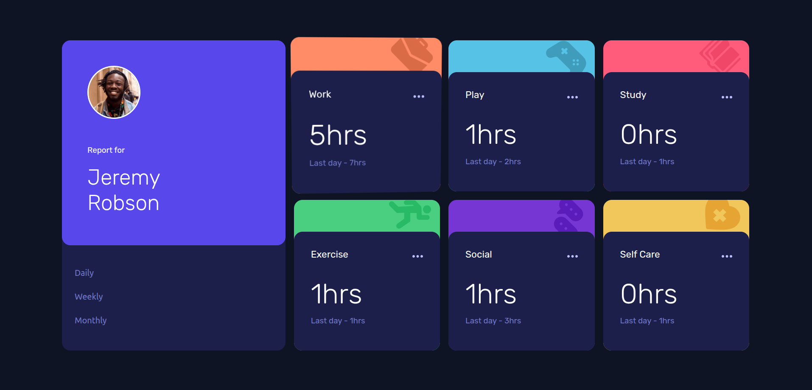
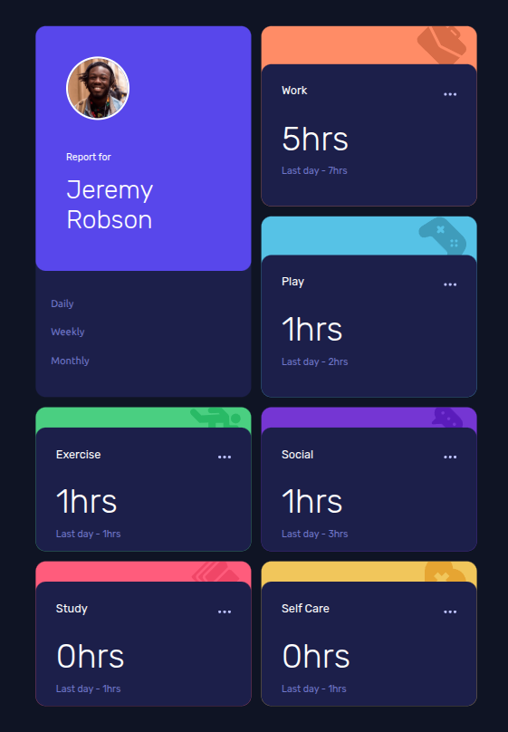
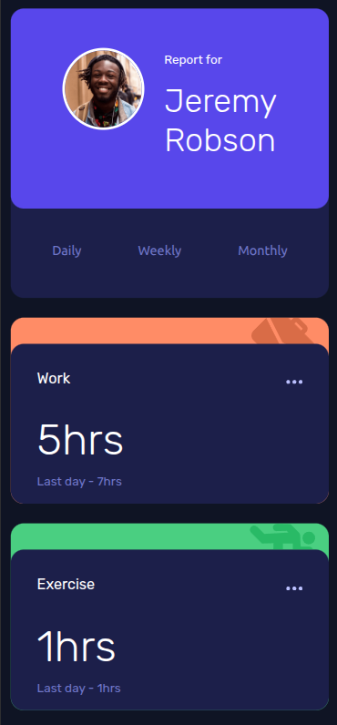

# Frontend Mentor - Time Tracking Dashboard Solución

Esta es una solución de [Time tracking dashboard challenge on Frontend Mentor](https://www.frontendmentor.io/challenges/time-tracking-dashboard-UIQ7167Jw). Los desafíos de Frontend Mentor ayudan a mejorar tus habilidades de programación construyendo proyectos realistas.

## Tabla de contenidos

- [Resumen](#resumen)
  - [El desafio](#el-desafio)
  - [Capturas de Pantalla](#capturas-de-pantalla)
  - [Links](#links)
- [Mi Proceso](#mi-proceso)
  - [Construido con...](#construido-con)
  - [Que aprendi](#que-aprendi)
  - [Continuar desarrollando](#continuar-desarrollando)
  - [Recursos utiles](#useful-resources)
  - [IAs utilizadas](#ias-utilizadas)
- [Autor](#autor)

## Resumen

### El desafio

Los usuarios deberían poder hacer:

- Ver el diseño de la página adaptado a su tamaño de pantalla según su dispositivo
- Ver los efectos al pasar el cursor por encima de todos los elementos interactivos en la página
- Alternar entre estadísticas diarias, semanales, y mensuales

### Capturas de pantalla

### Links

- Visitar página en tiempo real: [Add live site URL here](https://your-live-site-url.com)

## Mi Proceso

### Construido con...

- Semantic HTML5 markup
- CSS custom properties
- Flexbox
- CSS Grid
- JavaScript Vanilla 
- Bootstrap - CSS Framework (https://getbootstrap.com/)

### Que aprendi

Pude comprender con mayor facilidad el diseño en grilla y su comportamiento tanto en diseños de celular como en tablets.

### Continuar desarrollando

Quiero enfocarme en proyectos que sean realistas y que me ayuden a mejorar habilidades relacionadas al diseño y la accesibilidad.
Considero que mi lógica de programación aún es un poco escasa, por lo tanto, quiero desarrollar aplicaciones y realizar ejercicios que me ayuden a fortalecer ese aspecto.

### Recursos utiles

- [CSS Grid Generator](https://cssgridgenerator.io/) - Esta herramienta simplificó el proceso inicial de maquetado del layout en grid.

- [Responsively App](https://responsively.app/) - Esta herramienta me ayudó a desarrollar y visualizar correctamente el diseño responsivo en distintos dispositivos.

### IAs utilizadas

- IAs utilizadas: ChatGPT
- Con qué motivo fueron utilizadas: depuración y búsqueda de posibles soluciones

## Autor

- Website - [Juan Cruz Tobares | Portfolio - Site](https://juancruz.dev)
- Frontend Mentor - [@juantobares4](https://www.frontendmentor.io/profile/juantobares4)
- Gmail - [@gmail.com](mailto:juantobares4@gmail.com)